# MemberMatters
MemberMatters is an open source membership and access management solution.

### Main Features
* Supports all major browsers with first class mobile support, dark mode, and native mobile app (capacitor).
* Kiosk mode with site sign/sign out feature (electron).
* Member registration system (signup, login, profile etc) with recurring membership payments via Stripe.
* Single Sign On (SSO) system implemented via the discourse protocol.
* Issue reporting tool.
* Access system built in with granular door and tool/machines permissions - read below for access control hardware resources.
* Admin Interface for managing all aspects of the system.
* Webcam snapshots, last swipes, who's on site, and other member tools.
* Full "Memberbucks" Support for on site payments via tapping a membership card.
* And many more! Look through the screenshots below or setup your own instance to play around.

### Deprecation Warning
The following features have been removed:
* Sendgrid integration - please use our Postmark integration instead.

The following features have now been deprecated and will be removed in a **future** release:
* Xero integration

## Getting Started
See the [getting started](/docs/GETTING_STARTED.md) instructions for how to run the MemberMatters software for your 
organisation. Once you've finished installing MemberMatters, your should read the [post installation steps](/docs/POST_INSTALL_STEPS.md) for important instructions on setting up and customising your instance.

### Compatibility
Currently, MemberMatters is only officially supported on the latest LTS release of Ubuntu Server. Being Docker, you should be able to run it on various other platforms, but minimal support will be available. We currently offer AMD64, ARM64 and ARMv7 builds on Dockerhub.

## Updates and Releases
The official changelog is available on the website [here](https://membermatters.org/CHANGELOG). You will also find each release [here](https://github.com/membermatters/MemberMatters/releases) on GitHub.

## Getting Started (Developers)
### Pre-Commit Hooks
We use husky and lint-staged to manage pre commit hooks. The first thing you should do is run `npm install` in this 
directory. This installs and configures the pre commit hooks automatically. After doing this, you should see them run
when you try to commit a file (for example, with `git commit -m "update thing"`).

### Vue.js JavaScript frontend 
Please see the [readme](frontend/README.md) file inside the `frontend` folder. This folder contains all of the source
code and other assets needed by the frontend.

### Django Python backend
Please see the [readme](memberportal/README.md) file inside the `memberportal` folder. This folder contains all of the source
code and other assets needed by the backend.

### Development tip (dev server proxy)
The Vue.js (Quasar) frontend and Django backend run different dev servers on different ports. Due to
this you will run into issues with sharing cookies etc across the different URIs. To get around 
this, the webpack dev server has been setup to proxy all requests to `/api` to `localhost:8000` so 
you'll need to make sure the django dev server is running there.

## Door, Interlock & Vending Machine Resources
This software was initially developed by Jaimyn Mayer for HSBNE, and later adopted for use at Brisbane Makerspace and others. As part of our access control system (including doors and machine interlocks) we have developed a set of standard hardware components and firmware that is compatible with MemberMatters. Below is a list of useful resources for building your own hardware using off the shelf components. Once the hardware is built and firmware is flashed, you can add them to MemberMatters for a complete access system and/or billing system for physical purchases.

* [HSBNE Inc Access Control Wiki Page](https://wiki.hsbne.org/infrastructure/services/accesscontrol) - Information about our current and past access control hardware.
* [HSBNE Access Control Firmware](https://github.com/HSBNE/AccessControl) - Arduino based software that runs on ESPxx devices that run each of our interlock/door controllers.
* [HSBNE Access Control Hardware BOM](https://docs.google.com/spreadsheets/d/1sQvaxc8gp7CUdddq65luUwCwQNSQK4HCsXnodN-CSEk/edit#gid=0) - A list of materials that go into our access control system hardware.
* [Vending Machine RFID Panel Firmware](https://github.com/HSBNE/VendingMachine) - Arduino based software that powers our Spacebucks (memberbucks) enabled vending machines.
 
## Screenshots
### Mobile
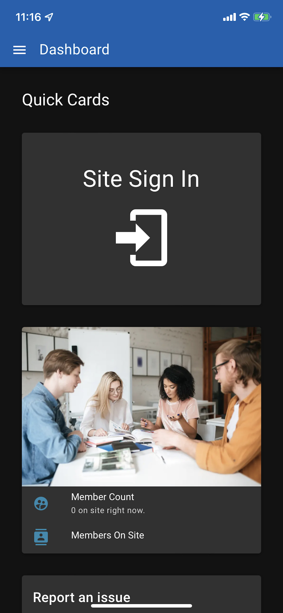 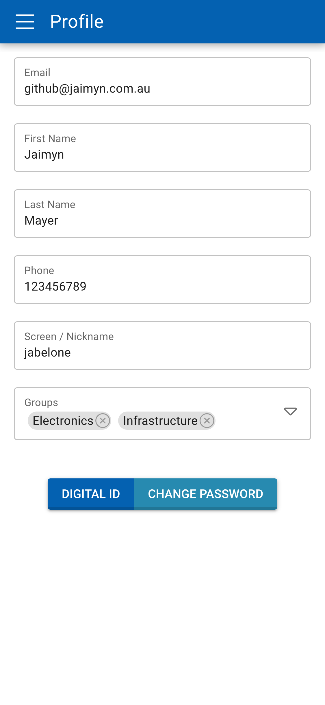 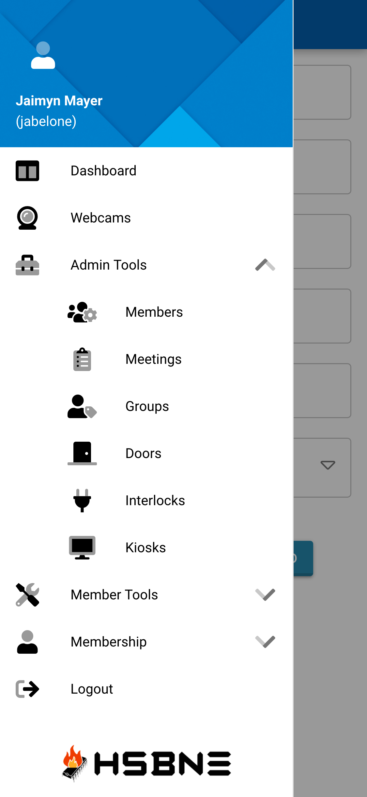 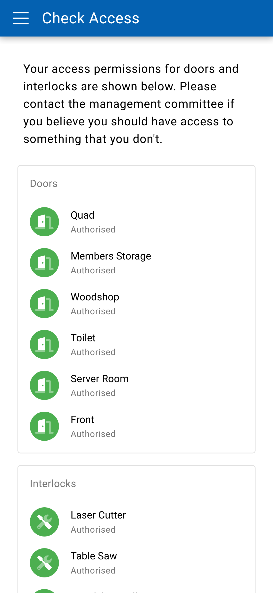 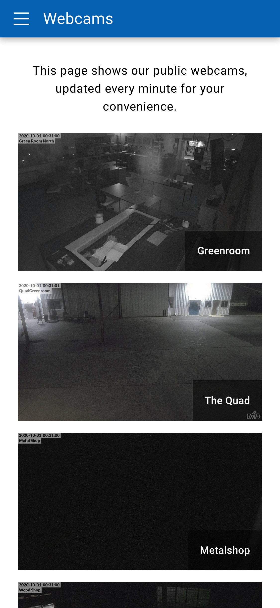

### Desktop
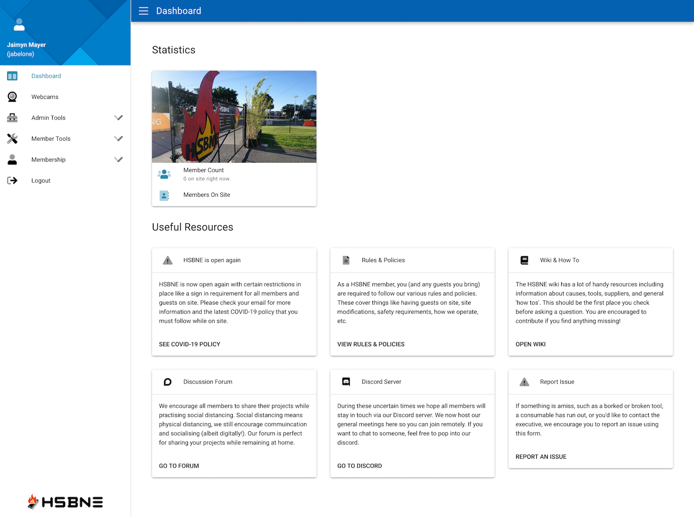 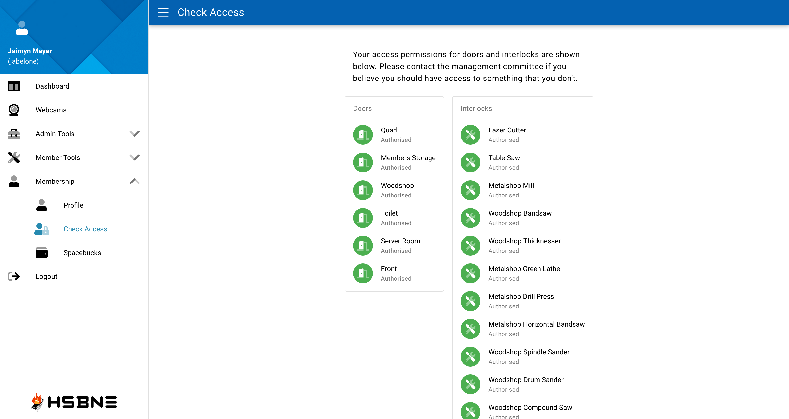 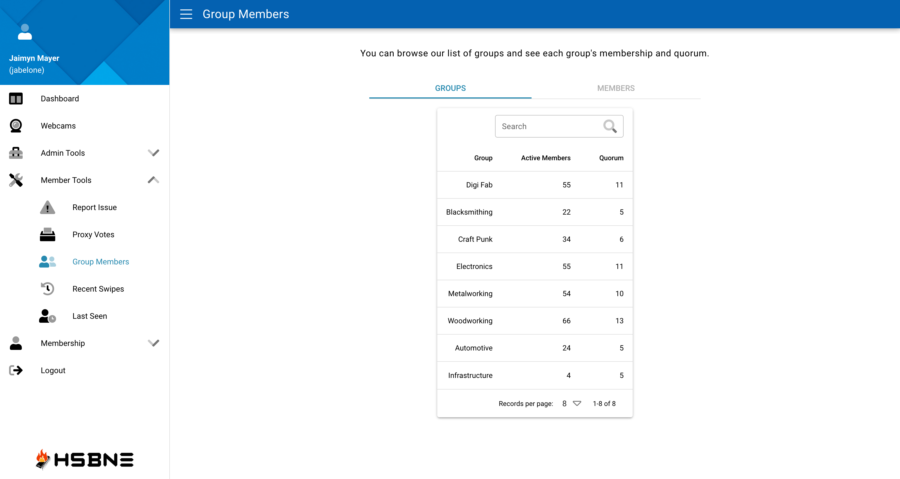 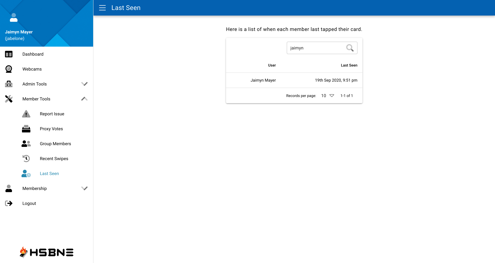 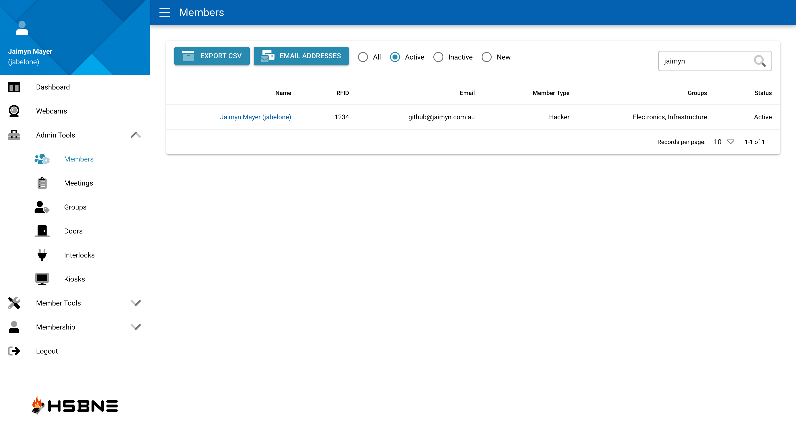

### Desktop (Dark Mode)
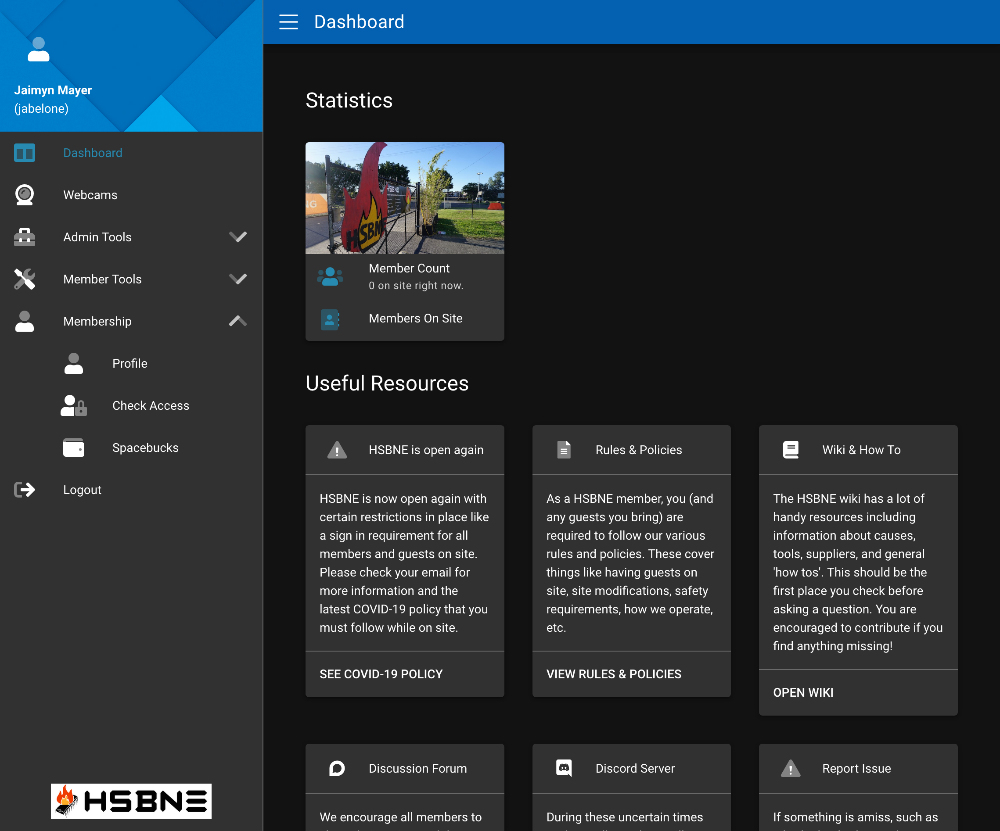 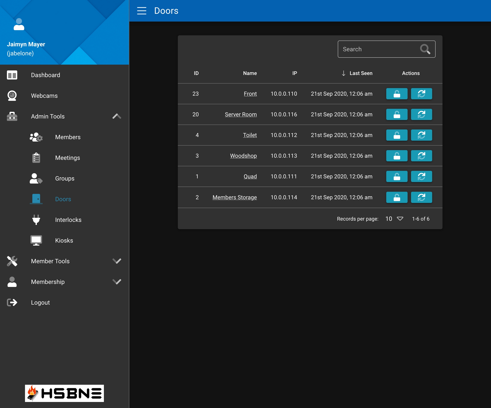 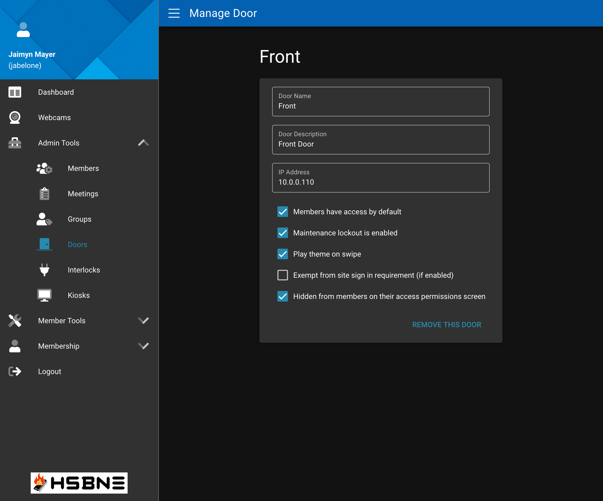

See the [screenshots](screenshots) folder for more screenshots.

## Contributing guidelines
By contributing code, or any other resource to this repository, you agree to license it
under the open source MIT license. Please use good coding practices, comment 
your code well and ensure compliance with any code formatting or linting that's in place. Also 
avoid "weird tricks" and optimisations that don't read easily - this is a web app, not a high 
performance algorithm. Your contributions *will* be rejected if you do not follow these guidelines so please be careful.

## Organisations using MemberMatters
Feel free to add your organisation to this list (via a pull request) if you're actively using or trialling MemberMatters and are a not for profit or similar. Make sure to include a link to your website and the date you added it.

* [Brisbane Makerspace](https://brisbanemaker.space) (October 2021) - A community workshop for makers in Brisbane, with a focus on high quality tools.
* [HSBNE Inc](https://hsbne.org) (January 2020) - A hackerspace based in Brisbane, QLD.
* [SparkCC](https://www.sparkcc.org) (September 2021) - A community of makers on the NSW Central Coast
