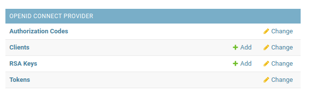
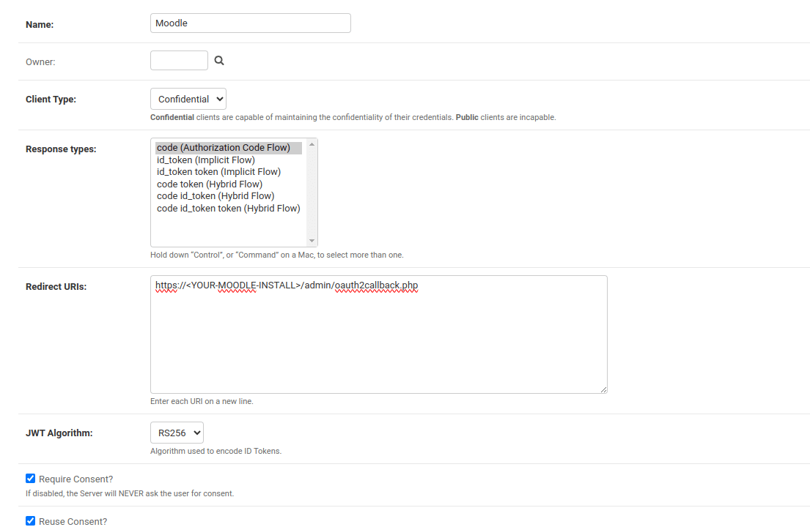
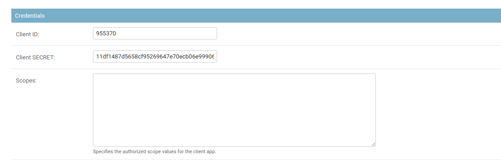
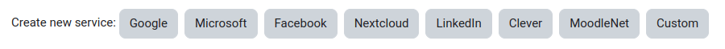
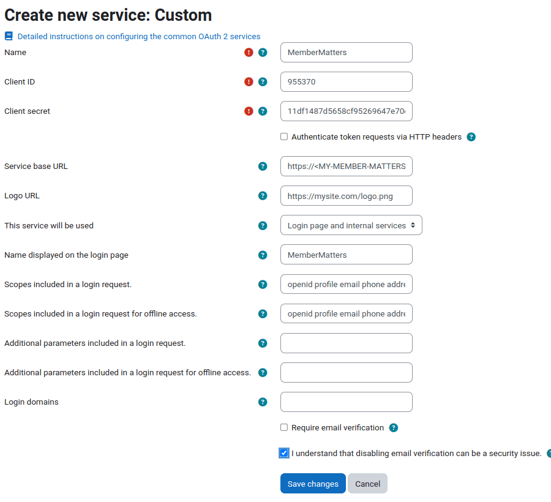
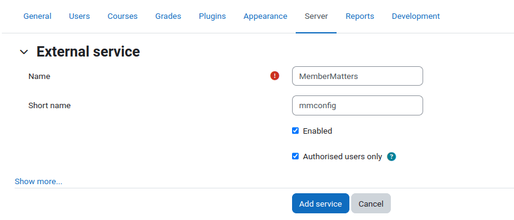
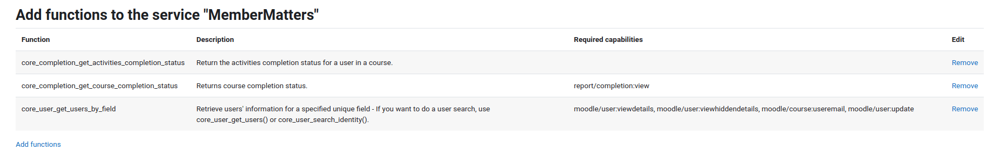
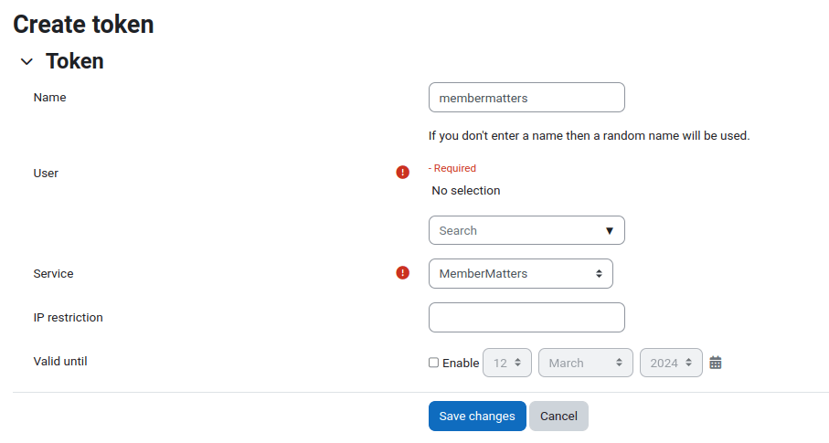
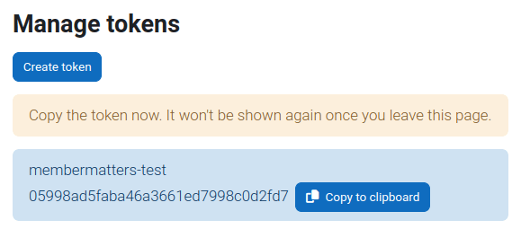

# Moodle Integration

[Moodle](https://moodle.org/) is an open-source Virtual Learning Environment (VLE) that can either be hosted by a thrid-party or on your own infrastructure.

The great thing about having a VLE as part of your space is that you can provide your members with access to online learning courses whenever it suits them rather than having to organise everyone to be in the same place at the same time.

MemberMatters can use Moodle as part of the sign-up process to provide an induction course that all new members must take before their accounts are activated.

## How does it work?

MemberMatters has an [OAuth2](https://oauth.net/2/) server built in that allows your members to log in to many other applications using their MemberMatters username and password.

We will use this centralised authentication option to connect to Moodle and create new users in Moodle as part of the sign-up process.

Members will then be able to access Moodle and any courses that you have created via their MemberMatters credentials.

## What do I need?

Installing and configuring Moodle (other than the authentication) is out of scope of these instructions however, the [Moodle installation guide](https://docs.moodle.org/403/en/Installing_Moodle) is a good place to start.

We assume the following:

   1. You have MemberMatters installed and running in production behind a TLS/SSL Certificate
   2. You have a Moodle installation running in production behind a TLS/SSL Certificate
   3. Moodle can connect to MemberMatters
   4. MemberMatters can connect to Moodle

**NOTE: You MUST have TLS/SSL in place (https://) in order for this to work.**

In order to achieve (3) and (4), you may want to host these systems on the same server, on the same network inside your space, or on the public internet.  How to secure these platforms and keep them updated is also outside the scope of these instructions.

## Setting up the platform

### MemberMatters OAuth2 Setup

Log in to your MemberMatters admin portal (https://<your-member-matters-url>/admin) and add a new OpenID Connect Provider Client:

Fill in the name, set the `client type` to "Confidential", and the `response types` to "code (Authorization Code Flow)".  Finally, set the `redirect URLs` to the oauth2 callback for your Moodle installation, which is usually `https://your-moodle-install/admin/oauth2callback.php`:

Click "Save and Continue Editing" to retrieve the credentials:

Leave this tab open, and browse to `https://<MY-MOODLE-SITE>/admin/tool/oauth2/issuers.php` in a new tab. 

### Moodle OAuth Setup

**NOTE:** You MUST log in as your Moodle admin user in order for the rest of this process to work!

Select `Custom Service` from the options to create a new service:

Fill in the form, making sure to add the ClientID and Client Secret from the MemberMatters configuration screen you left open in the previous tab.

For the `Service Base URL`, you should enter `https://<MY-MEMBER-MATTERS-URL>/api/openid/` - Moodle will auto-discover the rest of the settings from this url.

Make sure to set `This service will be used` to "Login Page and Internal Services" - this allows users to both log in, and control various items within Moodle.

Set a name to be displayed on the login page, and update both `Scopes to be included` fields to "openid profile email phone address".

Finally, uncheck `Require Email Verification` and check the box that says you understand about disabling email verification.  If we were allowing anyone visiting the website to sign up, then we would need to take this into account, however we're only going to allow people with a MemberMatters account to log in to Moodle, so we don't need to worry about it.

Your screen should now look a bit like this:

Save your changes, go to `https://<MY-MOODLE-SITE>/admin/settings.php?section=externalservices` and click `add`.

Create a new external service:

When prompted to add functions, add the following:

   * `core_completion_get_activities_completion_status`
   * `core_completion_get_course_completion_status`
   * `core_user_get_users_by_field`

We're nearly there, but Moodle is less than straight-forward when it comes to setting this up, so we've got a couple more things to do.

Go to `https://<MY-MOODLE-SITE>/admin/settings.php?section=manageauths` and enable OAuth2 by clicking on the closed eye icon.

Click on the `Test Settings` link, then click on the login button for your MemberMatters installation.  You should be redirected to MemberMatters, and then back to Moodle, and if everything is working then Moodle should show your name, nickname, email, and phone number as stored in MemberMatters.

As a final test, log out of Moodle, then use the MemberMatters button to log in.

If everything works then congratulations, you can continue to create your API Key and induction course.

If you run into any errors, please [log a bug in Github](https://github.com/membermatters/MemberMatters/issues) or join the Discord server and we'll try to help!

The last step is to create an API key for MemberMatters to check on course status in Moodle.

Navigate to `https://<MY-MOODLE-SITE>/admin/webservice/tokens.php` and create a new token:

Select your custom service from the `Service` dropdown, and your admin user from the `User` search (**Note**: You should really create a new user for this, but again, that is out of scope of this document). Uncheck the `valid until` checkbox, ensure there aren't any IP restrictions unless you understand what this means, and click "save".o

Make a note of this value, you'll need it for the next steps.

## Induction Course

Creating the induction course is out of scope of this tutorial, however once you have the course created go to the Constance configuration screen in MemberMatters (https://<MY-MEMBER-MATTERS-SITE>/admin/constance/config/) and scroll down to the `Moodle (LMS) Integration` section.

Enable the Moodle integration and input the Moodle API Key you created above, your Moodle site address, and the course ID, then save your settings.

Any new user should now automatically be redirected to your Moodle induction course and be able to log in via MemberMatters to complete the course.  Once the course is complete, they will be returned to MemberMatters.

In future, they can log in to any courses they want to take on your Moodle installation using their MemberMatters account.
